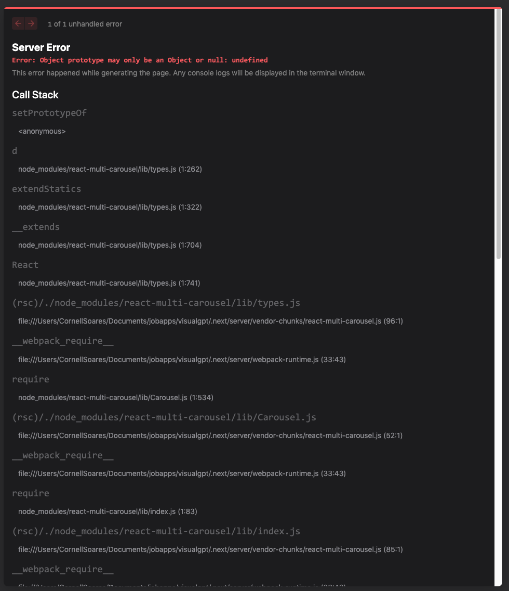

# VisualGPT

## Steps to run this project locally

1. Ensure you have Node js version v18.17.0 or greater installed. You will need this version of Node to run the project.

2. Clone to your local environment

`git clone https://github.com/soarecor/visualGPT`

3. Install all dependencies

`npm install`

4. Run the project

`npm run dev`

## Improvements that could be made

1. Images and text in the carousel begin streaming while the Title is still streaming. This can be fixed by adding the Title under the same context (via React's useContext hook) as text. This was attempted - however I kept running into issues with Next as shown in the image below.
   

2. A skeleton loader can be added to show text below the image also loading separately from the image.

3. The carousel arrows can be customized to something more specific and spaced out so they do not overlap the images.

4. The carousel can be styled to be more responsive for tablet and mobile.

5. Automatically scroll the carousel as more images and text start streaming.
